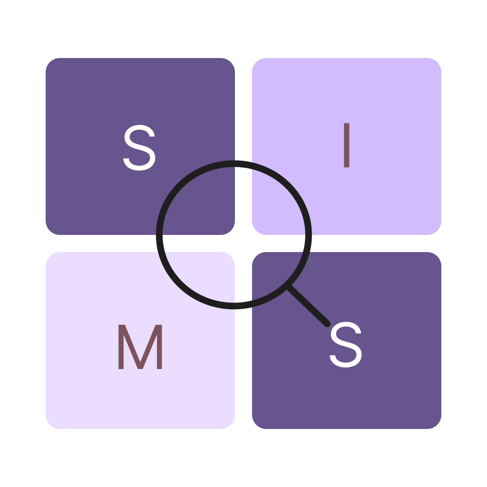

<div align="center">



# SIMS

**Semantic Image Search for your phone — find photos by describing them.**

Type "beach sunset", "dog on a couch" or "birthday cake" and SIMS finds the photo.
100% on-device. Your photos never leave your phone.

[](https://flutter.dev)
[](https://dart.dev)
[](https://www.android.com)
[](https://onnxruntime.ai)
[](https://github.com/tursodatabase/libsql)
[](#-contributing)
[](#-privacy)

[Features](#-features) •
[How it works](#-how-it-works) •
[Tech stack](#-tech-stack) •
[Getting started](#-getting-started) •
[Contributing](#-contributing)

</div>

---

## ✨ Features

- 🔍 **Natural-language search** — describe what's in the photo, not file names or dates.
- 🔒 **Private by design** — models, index and search all run on your device.
- ✈️ **Works offline** — the network is only used for the one-time model download.
- ⚡ **Fast vector search** — embeddings are stored in a local libSQL database and searched by exact cosine distance (no approximate index, so no missed results).
- 🔄 **Stays up to date** — newly taken photos are picked up and added to the index.
- 🌙 **Background indexing** — keep using your phone while your library is indexed.
- ❤️ **Favorites, sharing and "open in gallery"** from any result.

## 🧠 How it works

```
 Photo library ──► CLIP preprocess ──► image encoder (ONNX) ──► 512-d embedding ─┐
                                                                                 ▼
                                                                         libSQL (cosine k-NN)
                                                                                 ▲
 "beach sunset" ──► CLIP tokenizer ──► text encoder (ONNX) ──► 512-d embedding ──┘
                                                                                 │
                                                                            top-k results
```

1. **Index your photos** — on first launch SIMS scans your library and encodes each photo with OpenAI's CLIP ViT-B/32 image encoder. Images are resized (shorter side to 224, bicubic), center-cropped and normalized with CLIP's mean/std.
2. **Search with plain language** — your query is tokenized with CLIP's byte-pair-encoding tokenizer and encoded by the text encoder into the same 512-d embedding space.
3. **Browse results** — the nearest photos are returned via cosine-distance k-NN search. Tap one to view, share, open in your gallery app or favorite it.

Both encoders are int8-quantized ONNX models (~200 MB total) that output L2-normalized embeddings.

> For a deeper dive into the architecture, see [CODE_DOCUMENTATION.md](CODE_DOCUMENTATION.md).

## 🛠 Tech stack

| Concern | Technology |
|---|---|
| Framework | [Flutter](https://flutter.dev) / [Dart](https://dart.dev) (`^3.11.0`) |
| ML inference | [ONNX Runtime](https://onnxruntime.ai) via [`flutter_onnxruntime`](https://pub.dev/packages/flutter_onnxruntime) |
| Models | OpenAI [CLIP ViT-B/32](https://github.com/openai/CLIP) image & text encoders (int8-quantized ONNX, ~200 MB), downloaded on first run. Exported by [`tools/export_clip`](tools/export_clip) |
| Vector database | [libSQL](https://github.com/tursodatabase/libsql) via [`libsql_dart`](https://pub.dev/packages/libsql_dart) |
| Gallery access | [`photo_manager`](https://pub.dev/packages/photo_manager) |
| Image processing | [`image`](https://pub.dev/packages/image) |
| Networking | [`dio`](https://pub.dev/packages/dio) |
| Background work | [`workmanager`](https://pub.dev/packages/workmanager), [`flutter_local_notifications`](https://pub.dev/packages/flutter_local_notifications) |
| Sharing / linking | [`share_plus`](https://pub.dev/packages/share_plus), [`url_launcher`](https://pub.dev/packages/url_launcher) |
| Linting | [`flutter_lints`](https://pub.dev/packages/flutter_lints) |

## 🚀 Getting started

### Prerequisites

- [Flutter SDK](https://docs.flutter.dev/get-started/install) with Dart `^3.11.0`
- [Android Studio](https://developer.android.com/studio) with the Android SDK
- A physical device or emulator with some photos in its gallery

### Run locally

```bash
# Clone the repo
git clone https://github.com/Chandan-CV/sims.git
cd sims

# Install dependencies
flutter pub get

# Run the app (requires a connected device or emulator)
flutter run
```

On first launch SIMS downloads the ONNX models (~200 MB), then asks for photo library access to build the index.

### Run the tests

```bash
flutter test
```

The tokenizer and image preprocessing are checked against the reference Hugging Face CLIP implementation (`test/tokenizer_test.dart`, `test/image_preprocessor_test.dart`).

## 📦 Building the models

The app downloads two ONNX files from a GitHub release (URLs and filenames are in `lib/utils/constants.dart`). They are produced from OpenAI's [`openai/clip-vit-base-patch32`](https://huggingface.co/openai/clip-vit-base-patch32) weights by the scripts in [`tools/export_clip`](tools/export_clip):

```bash
cd tools/export_clip
python3 -m venv .venv && source .venv/bin/activate
pip install -r requirements.txt     # torch, transformers, onnx, onnxruntime, numpy, pillow

python export_clip.py --per-channel # exports fp32 ONNX, then quantizes to int8 -> out/
python validate.py                  # checks int8/fp32 ONNX against the PyTorch model
python validate.py --images a.jpg b.jpg   # also compares zero-shot top captions on real photos
deactivate
```

| Output (`tools/export_clip/out/`) | Size | Notes |
|---|---|---|
| `clip_vit_b32_image_int8.onnx` | ~96 MB | `image_input [B,3,224,224]` → `image_embeddings [B,512]` |
| `clip_vit_b32_text_int8.onnx` | ~102 MB | `text_input int64 [B,77]` → `text_embeddings [B,512]` |

- Both outputs are L2-normalized in the graph; the text encoder pools at the end-of-text token in the graph, so no attention mask is needed.
- Quantization is dynamic int8 on `MatMul`/`Gather` weights. The patch-embedding convolution stays fp32, and so do the text encoder's MLP `fc2` layers: quantizing those dropped its cosine similarity to the fp32 model from ~0.998 to ~0.93.
- `--fp16` also writes fp16-weight variants, and `--exclude-image` / `--exclude-text` keep matching layers in fp32.
- The first run downloads ~600 MB of weights from Hugging Face.

To publish a new model: upload the two `*_int8.onnx` files to a GitHub release matching `kModelReleaseBaseUrl`.


## 🔒 Privacy

- Photos are never uploaded anywhere.
- Embeddings and the search index are stored locally on your device.
- The only network request is the one-time download of the model files (~200 MB).

## 🤝 Contributing

Contributions are what make open source great — bug reports, ideas and pull requests are all welcome.

1. Fork the repository
2. Create a feature branch: `git checkout -b feat/amazing-feature`
3. Make your changes and make sure `flutter analyze` and `flutter test` pass
4. Commit your changes: `git commit -m "feat: add amazing feature"`
5. Push to your branch: `git push origin feat/amazing-feature`
6. Open a pull request

Found a bug or have a feature request? [Open an issue](https://github.com/Chandan-CV/sims/issues).

## 🗺 Roadmap

- [ ] Search-quality improvements
- [ ] Offloading preprocessing and inference to background isolates
- [ ] More automated tests (tokenizer and preprocessing parity tests exist)
- [ ] More model options (e.g. CLIP ViT-B/16)
- [ ] Checksum verification of downloaded models


## 🙏 Acknowledgements

- [CLIP](https://github.com/openai/CLIP) by OpenAI (MIT) for the image and text encoder models
- [ONNX Runtime](https://onnxruntime.ai) for on-device inference
- [Turso / libSQL](https://github.com/tursodatabase/libsql) for the embedded vector database
- [Flutter](https://flutter.dev) and the maintainers of every package listed above

<div align="center">

If you find SIMS useful, consider giving it a ⭐

</div>
